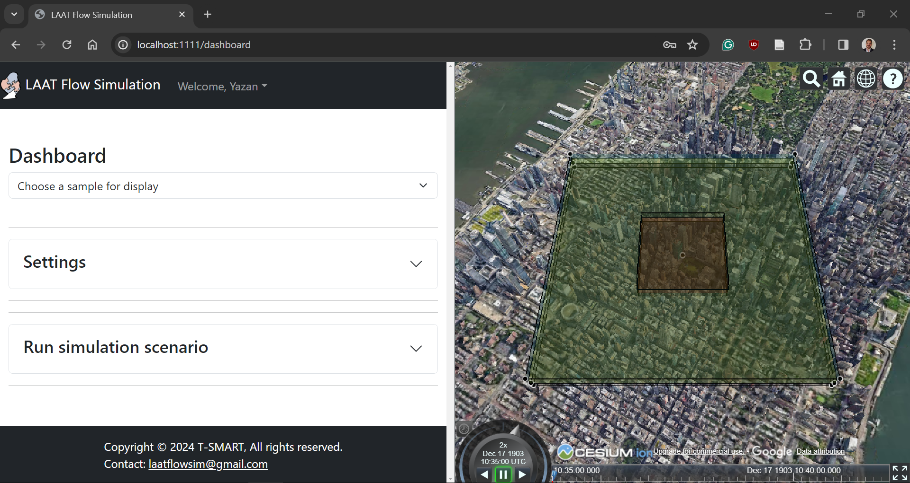

# LAATSim The AAM Simulation Tool Shaping the Future of Urban Mobility

The urban transportation landscape is on the verge of a revolution with the rise of Advanced Air Mobility (AAM) systems. These low-altitude passenger and delivery vehicles hold immense potential but require sophisticated tools to propel research and development.

**Introducing LAATSim, the groundbreaking AAM simulation tool.** This innovative software meticulously replicates AAM systems in a digital environment, enabling users to model and analyze their behavior and performance with unparalleled accuracy.

**Empowering Stakeholders in the AAM Ecosystem.** LAATSim's modular framework empowers a diverse range of AAM stakeholders. Users can leverage a comprehensive toolkit and library to design and plan AAM operations, while developers have the freedom to contribute and build microservices through an open API gateway.

**More than a Tool, It's a Catalyst for Collaboration.** LAATSim sets the stage for groundbreaking research in the burgeoning field of AAM. We aim to inspire collaboration on a national and global scale, fostering a platform for innovation and advancement within the entire AAM ecosystem.

<br />

<br />

## Mission

The emergence of Advanced Air Mobility (AAM) holds immense potential to revolutionize urban transportation. However, integrating these low-altitude passenger and delivery vehicles into cityscapes requires navigating a complex landscape of challenges.

**At LAATSim, our mission is to empower stakeholders across the AAM ecosystem by providing a groundbreaking simulation tool that tackles these critical challenges head-on.**

**Understanding the Challenges**

* **Authentic Environment Creation:**  Accurately replicating real-world conditions is essential for reliable simulation and informed decision-making. LAATSim is meticulously designed to deliver unparalleled authenticity, enabling users to analyze AAM behavior and performance confidently.
* **Data-Driven Insights:**  Effective AAM development hinges on robust data analysis. LAATSim's comprehensive data visualization capabilities provide stakeholders with the insights they need to optimize operations and unlock new opportunities.
* **Scalability and Adaptability:**  AAM research requires flexibility. LAATSim's modular architecture allows users to customize simulations and integrate existing solutions, ensuring the tool scales effectively with evolving research needs.
* **Human Behavior Integration:**  Understanding human behavior within AAM systems is crucial. LAATSim facilitates exploring how individuals and communities interact with AAM vehicles, fostering the development of safe and user-centric solutions.

**LAATSim: A Catalyst for Collaboration**

By addressing these challenges, LAATSim empowers a diverse range of stakeholders, including:

* **Academia and Research Centers:**  LAATSim equips researchers to explore critical areas like human factors, modeling development, and overall AAM system design.
* **Regulators:** Our tool provides a platform to simulate complex airspace scenarios, informing the development of effective regulations for safe and efficient AAM integration.
* **Industry Players:** LAATSim equips AAM system and aircraft designers with a comprehensive platform to validate their designs within a realistic operational environment, accelerating the path to commercialization.

LAATSim fosters continuous progress toward a thriving AAM ecosystem that benefits all stakeholders through collaboration and a commitment to overcoming challenges.

<br />

<br />

## Software Design

LAATSim's core revolves around a modular framework that empowers users with a customizable and extensible platform for simulating AAM operations. This section delves into the key components and functionalities that facilitate a comprehensive simulation environment.

**Modular Architecture for Flexibility**

LAATSim leverages a modular architecture, allowing users to tailor simulations to specific needs. This is achieved through:

* **Microservices:** The framework utilizes a collection of microservices, essentially independent software units, each encapsulating a specific functionality within the simulation. These microservices can be easily integrated or replaced, enabling customization and future expansion.
* **Open API Gateway:** Developers can contribute new functionalities by developing and integrating their microservices through a secure API gateway. This fosters a collaborative environment and promotes continuous improvement of the framework.
* **Plugin Support:** The framework allows for the integration of plugins, further extending its capabilities. These plugins, such as advanced visualization tools or specialized data analysis modules, can address specific AAM-related needs.

**Core System: The Orchestrator**

The core system acts as the central orchestrator, managing data flow and communication within the framework. Here's a breakdown of its key responsibilities:

* **Microservice and Database Management:** The core system manages the interaction between user requests, microservices, and databases. It retrieves relevant microservices and data based on the user's simulation requirements.
* **Model Classification:** Microservices and databases are categorized into three main groups: Modeling (libraries for simulation components), Ruling (standardized models aligned with regulations), and Scenarios (user input and existing data defining the simulation environment).
* **API Gateway Communication:** The core system interacts with the user interface through an API gateway, facilitating data exchange and delivering simulation results.

**User Interface: Tailored Insights**

The user interface (UI) serves as the primary interaction point for users. It provides a web-based platform for:

* **Customizable Views:** The UI can be customized based on the user's sector (industry, academia, regulation, operations). This ensures that relevant insights and data visualizations are presented effectively.
* **Data Export:** Users can export simulation outputs, including data and reports, for further analysis and documentation.

**Microservices: Building Blocks of Simulation**

Microservices are the building blocks for simulating AAM operations. Each microservice represents a set of libraries and applications encompassing specific models and algorithms. These can include:

* **Human Behavior Modeling:** Models simulate how humans, including pilots, air traffic controllers, and passengers, interact with the AAM system.
* **Aircraft Dynamics Modeling:** Models that capture the flight characteristics and performance of AAM vehicles.
* **Airspace Management Modeling:** Models that simulate airspace utilization, traffic flow, and potential conflicts.
* **Subsystems Modeling:** Models that represent specific AAM subsystems, such as propulsion systems or communication networks.

**Database Management: Storage and Security**

The framework utilizes a robust database system to store various data elements crucial for simulations:

* **Settings and Parameters:** Databases store various aircraft, airspace, traffic, and simulation settings used for analysis. User inputs are also stored in designated databases with appropriate security measures.
* **Real-Time Data Integration:** In real-time operation scenarios, encrypted measurement data can be stored in a dedicated database. This data can be anonymized and used for future research and development efforts.
* **Compliance with Regulations:** Data encryption adheres to local regulations, ensuring data privacy and security.

**Cloud-Based Infrastructure: Scalability and Performance**

LAATSim leverages a cloud-based server infrastructure to provide:

* **Virtual Private Cloud (VPC):**  The VPC allocates dedicated resources for each user's simulation, enabling high-performance computing for complex scenarios and real-time operations.
* **Seamless User Experience:** The user interface functions as a server-side web application, eliminating users' need to install specific software. Additionally, the VPC grants users access to relevant data based on their permissions. 

**Openness for Collaboration and Innovation**

LAATSim fosters collaboration and innovation through the following features:

* **Developer Access:** External developers can leverage the API gateway to build and contribute new microservices, enriching the framework's functionalities.
* **Plugin Integration:** Licensed plugins can be integrated to address specific user needs, further enhancing the simulation capabilities.

**To conclude,** LAATSim's software design prioritizes modularity, flexibility, and user experience. By leveraging microservices, open APIs, and cloud-based infrastructure, the framework empowers users to conduct comprehensive AAM simulations, fostering informed decision-making and accelerating the development of this promising transportation technology. The proposed software design is shown in Figure 1.

<br />

<div align="center">

**Figure 1.** *LAATSim Simulation Software Design*
</div>

<br />

<br />


## Application


### LAATSim-CesiumJS Integration

The LAATSim is a powerful web-based application designed to streamline and enhance air mobility scenario modeling, analysis, and optimization. This modular tool leverages the strengths of various technologies to deliver a user-friendly and visually immersive experience. CesiumJS is a powerful open-source JavaScript library designed to create interactive 3D globes and maps within web browsers. It leverages WebGL for hardware-accelerated graphics, enabling smooth and performant geospatial data visualization. Let's delve into how CesiumJS plays a crucial role in this application:

**Realistic Airspace Environment:**

CesiumJS, a powerful geospatial visualization library, provides the foundation for rendering a realistic 3D representation of the airspace. This allows users to visualize simulated scenarios within a familiar and geographically accurate context. Imagine seeing low-altitude aircraft trajectories overlaid on a digital map with detailed terrain, buildings, and other relevant environmental features. CesiumJS empowers users to intuitively grasp the spatial relationships and potential interactions within the airspace.

**Interactive Visualization:**

CesiumJS offers extensive capabilities for interactive visualization. Users can zoom, pan, and rotate the 3D airspace environment, comprehensively understanding the simulated scenarios from various perspectives. This interactivity facilitates in-depth analysis and exploration of air traffic patterns, potential conflicts, and overall airspace utilization.

**Data Integration:**

CesiumJS seamlessly integrates with other technologies used in the LAATSim. For instance, flight path data generated by the simulation engine can be seamlessly visualized within the CesiumJS-powered 3D environment. This allows users to directly observe the simulated behavior of low-altitude aircraft within the context of realistic airspace.

**Enhanced User Experience:**

The integration of CesiumJS significantly elevates the user experience of the LAATSim. By replacing traditional 2D visualizations with a dynamic 3D environment, CesiumJS fosters a more intuitive and engaging user experience. This visual representation aids in comprehending complex air traffic scenarios and facilitates informed decision-making.

CesiumJS plays a vital role in the LAATSim by providing a realistic, interactive, and user-friendly platform for visualizing and analyzing air mobility scenarios. It empowers users with a powerful tool to explore, optimize, and ultimately pave the way for the future of efficient and safe air traffic management.

<div align="center">

**Figure 2.** *LAATSim integration with CesiumJS - User interface*
</div>

Learn more about CesiumJS: https://cesium.com/platform/cesium-ion/.

<br />


### Main Features:
<br />
#### (i) Data Synchronization from MATLAB to CesiumJS

The LAATSim tool encapsulates several critical parameters exported from the MATLAB simulation, serving as the foundation for visualizing the scenario in CesiumJS. Let's delve into the key data structures:

- **`SimInfo`:** This object stores vital simulation time information, including:
  - `tf`: The final simulation time (in seconds).
  - `dtS`: The simulation time step (in seconds).
  - `x`, `y`, `z`: Arrays containing the aircraft's position coordinates throughout the simulation (in meters). These arrays correspond to the time steps `dtS` defined in `tf`, and are stored in the array `pdt`.
  - `stat`: An integer representing the aircraft's flight status (0: inactive, 1: active, 2: landed). These arrays correspond to the time steps `dtS` defined in `tf`, and are stored in the array `statusdt`.

- **`Settings`:** This object houses configuration details for the simulated airspace, comprising:
  - `dx`: The airspace size along the x-axis (in meters).
  - `dy`: The airspace size along the y-axis (in meters).
  - `dz`: The airspace size along the z-axis (in meters).
  - `as`: Additional airspace configuration settings (specific details might vary based on your simulation).

- **`ObjAircraft`:** This crucial element is an array of objects, each representing an aircraft within the simulation. Each object encompasses the following properties:
  - `tda`: The departure time of the aircraft (in seconds).
  - `taa`: The aircraft's arrival time (in seconds).
  - `rs`: The safety radius of the aircraft (in meters).
  - `rd`: The detection radius of the aircraft (in meters).


To seamlessly visualize simulation results in CesiumJS, a robust mechanism synchronizes data between MATLAB and the web-based frontend, as follows:
   - The core simulation runs in MATLAB, generating critical airspace data; for more info, please refer to [**Safadi et al. (2023)**](https://doi.org/10.1016/j.trc.2023.104141).
   - The `ExportJSON` function (code snippet below) compiles essential parameters into a structured JSON file.

<div align="center">
**Code 1.** *The function `ExportJSON` [MATLAB]*
</div>
```matlab
function [scenarioName] = ExportJSON(SceStr,SimInfo,ObjAircraft,TFC,EC,Settings)
M = SimInfo.M(end); % number of aircraft
full_pdt = full(SimInfo.pdt)'; % transform position matrix
full_stat = full(SimInfo.statusdt)'; % transform status matrix
ObjAircraftData = cell(1, M);
for i = 1:M
    x = double(full_pdt(3*i-2, :)); % x position [m]
    y = double(full_pdt(3*i-1, :)); % y position [m]
    z = double(full_pdt(3*i, :)); % z position [m]
    stat = double(full_stat(i, :));  % aircraft flight status {0-inactive, 1-active, 2-landed}
    ObjAircraftData{i} = struct(...
    'stat', stat,...
    'tda',max(ObjAircraft(i).tdp,0),... % aircraft departure time [s]
    'taa',min(ObjAircraft(i).taa,SimInfo.tf),... % aircraft arrival time [s]
    'rs',ObjAircraft(i).rs,... % aircraft safety radius [m]
    'rd',ObjAircraft(i).rd,... % aircraft detection radius [m]
    'x', x,...
    'y', y,...
    'z', z...
    );
end
Data.SimInfo.tf = SimInfo.tf; % simulation final time [s]
Data.SimInfo.dtS = SimInfo.dtS; % simulation time step [s]
Data.Settings.dx = Settings.Airspace.dx; % Airspace x-axis size [m]
Data.Settings.dy = Settings.Airspace.dy; % Airspace y-axis size [m]
Data.Settings.dz = Settings.Airspace.dz; % Airspace z-axis size [m]
% Export Object to JSON file
Data.ObjAircraft = ObjAircraftData;
json_str = jsonencode(Data);
TimestampNow = now;
scenarioName = [SceStr ' '  datestr(TimestampNow,'yyyy-mm-dd HH:MM')];
file_name = ['./public/Outputs/' 'SimOutput_' SceStr '_'  datestr(TimestampNow,'yyyymmdd_hhMM') '.json'];
fid = fopen(file_name, 'w');
if fid > 0
    fwrite(fid, json_str, 'char');
    fclose(fid);
    disp(['Data saved to ' file_name]);
else
    disp('Error opening the file for writing.');
end
end
```

**Benefits of this Approach:**

- **Streamlined Data Transfer:** JSON, a lightweight and cross-platform format, facilitates efficient transfer between MATLAB and the web environment.

- **Structured Data Representation:** JSON's hierarchical structure enables comprehensive and organized storage of simulation parameters.

- **Seamless Integration with CesiumJS:** CesiumJS directly accepts parsed JSON data, enabling the creation of rich and interactive visualizations.

**To conclude,** this robust synchronization process bridges the gap between MATLAB's simulation capabilities and CesiumJS's visualization prowess. It guarantees a seamless data flow, empowering users to explore and analyze air mobility scenarios within a dynamic and informative 3D environment.

<br />


#### (ii) Visualing Aircraft Motion by Converting XYZ Positions to Geospatial Coordinates (Longitude, Latitude, Height)

A crucial feature within the application involves transforming XYZ positions obtained from the simulation into meaningful geospatial coordinates (longitude, latitude, and height). This conversion process enables the visualization of aircraft trajectories within a real-world context on the CesiumJS model. The conversion workflow is as follows:


- **`computeNewPoint` Function:** This function takes the center point of the simulated airspace (`center`) and the XYZ offsets (`dx`, `dy`, `dz`) as input. Here's a breakdown of its functionality:

    - Offset Matrix Creation: The function utilizes `Transforms.eastNorthUpToFixedFrame` from the Cesium library. This method generates a transformation matrix that considers the Earth's curvature (using the WGS84 ellipsoid) to convert offsets relative to East, North, and Up (AGL) into a fixed-frame coordinate system.

    - Offset Point Calculation: The provided offsets (`dx`, `dy`, `dz`) are multiplied by the created transformation matrix (`offsetMatrix`) using `Matrix4.multiplyByPoint`. This operation effectively applies the East, North, Up offsets to the center point, resulting in the new converted point (`offsetPoint`) in the fixed-frame coordinate system.
<div align="center">
**Code 2.** *The function `computeNewPoint` [javascript]*
</div>
``` javascript
function computeNewPoint(center, dx, dy, dz) {
  var offsetMatrix = Transforms.eastNorthUpToFixedFrame(center, Ellipsoid.WGS84, new Matrix4());
  var offsetPoint = Matrix4.multiplyByPoint(offsetMatrix, new Cartesian3(dx, dy, dz), new Cartesian3());
  return offsetPoint;
}
```

- **Trajectory Point Conversion:** Inside the loop, a new array named `trajectoryPositions` is created to store the converted geospatial coordinates for each aircraft. The code iterates through the aircraft's XYZ position arrays (`ObjAircraft.x`, `ObjAircraft.y`, `ObjAircraft.z`) with a defined step size (`dt`). For each iteration:

    - The `computeNewPoint` function is called, taking the center point (`center`) and the current XYZ offsets (`dx`, `dy`, `dz`) as arguments.

    - The resulting converted point (`currentPosition`) is then pushed into the `trajectoryPositions` array.

<div align="center">
**Code 3.** *Trajectory Point Conversion [javascript]*
</div>
``` javascript
const trajectoryPositions = [];
for (let i = 0; i < ObjAircraft.x.length; i += dt) {
  const currentPosition = computeNewPoint(center, ObjAircraft.x[i], ObjAircraft.y[i], ObjAircraft.z[i]);
  trajectoryPositions.push({
    longitude: CesiumMath.toDegrees(Cartographic.fromCartesian(currentPosition).longitude),
    latitude: CesiumMath.toDegrees(Cartographic.fromCartesian(currentPosition).latitude),
    height: Cartographic.fromCartesian(currentPosition).height
  });
}
```

- **Animating Aircraft Movement:** Building upon the geospatial coordinate conversion, the `AddAircraftMotion` function plays a crucial role in animating the movement of aircraft within the CesiumJS visualization. This function takes a set of pre-calculated trajectory positions (converted from XYZ to geospatial coordinates) and injects them into the CesiumJS viewer, creating a visual representation of aircraft motion over time.

**Inputs:**

* `startSim`: (number) Defines the starting simulation time (converted from seconds to astronomical Julian date).
* `stopSim`: (number) Defines the ending simulation time (converted from seconds to astronomical Julian date).
* `timeStepInSeconds`: (number) Represents the time interval between each displayed position (in seconds).
* `index + 1`: (number) A unique identifier for the current aircraft being processed (incremented from `index`).
* `trajectoryPositions`: (array) An array containing the pre-computed geospatial coordinates (longitude, latitude, height) for the aircraft's trajectory.
* `ObjAircraft.status`: (string) Represents the status of the aircraft (e.g., "in-active", "active," "landed").
* `ObjAircraft.tda`: (number) Aircraft departure time (in seconds).
* `ObjAircraft.taa`: (number) Aircraft arrival time (in seconds).
* `ObjAircraft.rs`: (number) Aircraft safety radius (in meters).
* `ObjAircraft.rd`: (number) Aircraft detection radius (in meters).
* `entitiesArray`: (array) CesiumJS aircraft entity collection.

<div align="center">
**Code 4.** *Animating Aircraft Motion [javascript]*
</div>
``` javascript
AddAircraftMotion(startSim, stopSim, timeStepInSeconds, index + 1, trajectoryPositions, ObjAircraft.status, ObjAircraft.tda, ObjAircraft.taa, ObjAircraft.rs, ObjAircraft.rd, entitiesArray);
```

The `AddAircraftMotion` function plays a crucial role in animating aircraft movement within the CesiumJS visualization, with the following key CesiumJS features: 
* `Cartesian3.fromDegrees`: Converts geospatial coordinates to CesiumJS positions.
* `JulianDate`: Represents a specific point in time.
* `TimeIntervalCollection`: Defines the visibility timeframe for entities.
* `SampledPositionProperty`: Tracks the changing position of an entity over time.
* `Polyline`: Creates lines connecting a series of positions.
* `CallbackProperty`: Enables dynamic updates of entity properties based on functions.
* `Model`: Loads and displays 3D models within the viewer.
* `VelocityOrientationProperty`: Calculates the orientation of an entity based on its movement.
* `Ellipsoid`: Creates 3D spheres for visualization.
* `DistanceDisplayCondition`: Controls the visibility of entities based on viewer distance.

- **Iterating Aircraft Data:** The code snippet below iterates through the `ObjAircraft` array in the JSON data using `forEach`. This loop processes each aircraft object and its associated XYZ position data. However, the provided code limits the processing to a specific range (index 0 to 299) for demonstration purposes and runtime performance.
<div align="center">
**Code 5.** *Iterating Aircraft Data [javascript]*
</div>
``` javascript
data.ObjAircraft.forEach((ObjAircraft, index) => {
        if ((index > 0) & (index < 300)) {
            const trajectoryPositions = [];
            for (let t = 0; t < ObjAircraft.x.length; t += dt) {
                const currentPosition = computeNewPoint(center, ObjAircraft.x[t], ObjAircraft.y[t], ObjAircraft.z[t]);
                trajectoryPositions.push({
                    longitude: CesiumMath.toDegrees(Cartographic.fromCartesian(currentPosition).longitude),
                    latitude: CesiumMath.toDegrees(Cartographic.fromCartesian(currentPosition).latitude),
                    height: Cartographic.fromCartesian(currentPosition).height
                });
            } // IF INDEX END
            AddAircraftMotion(startSim, stopSim, timeStepInSeconds, index + 1, trajectoryPositions, ObjAircraft.status, ObjAircraft.tda, ObjAircraft.taa, ObjAircraft.rs, ObjAircraft.rd, 0, entitiesArray);
        }
    });
```
**Functionality:**

* **Geospatial Transformation:** At the core lies the `computeNewPoint` function. It leverages Cesium's `Transforms.eastNorthUpToFixedFrame` function to account for Earth's curvature (WGS84 ellipsoid) and convert relative XYZ offsets (`dx`, `dy`, `dz`) into geospatial coordinates (longitude, latitude, height) within a fixed-frame coordinate system.
* **Trajectory Animation:** The `AddAircraftMotion` function takes these converted geospatial coordinates and injects them into the CesiumJS visualization. It iterates through the trajectory positions, creating entities for each point along the aircraft's flight path. This process effectively animates the movement of aircraft over time.
* **Entity Creation:** For each position in the trajectory, a corresponding entity is created or updated within the `entitiesArray`. This entity holds the aircraft's visual representation and associated geospatial coordinates at that specific time step.

**Benefits:**

* **Real-World Visualization:** By converting simulated XYZ data into familiar geospatial coordinates (longitude, latitude, height), the application enables users to visualize aircraft trajectories within a real-world geographic context. This enhances user comprehension and facilitates the analysis of air traffic patterns within the simulated airspace.
* **Accuracy and Flexibility:** The integration of Cesium's geospatial transformation functions ensures accurate conversion while maintaining flexibility. The `computeNewPoint` function can be adapted to handle different coordinate system origins or offset calculation methods based on specific simulation requirements.
* **Seamless CesiumJS Integration:** The converted geospatial coordinates directly align with CesiumJS's data format, streamlining the creation of visually compelling and informative 3D visualizations of the simulated air traffic.

**To conclude,** this conversion approach bridges the gap between the simulated and real-world, fostering a more intuitive user experience for analyzing and understanding air mobility scenarios. The `computeNewPoint` function plays a crucial role by accurately converting simulated positions into meaningful geospatial coordinates. By incorporating `AddAircraftMotion`, the application transforms static coordinates into a dynamic visualization, enabling users to observe and analyze aircraft movements within the simulated airspace. This approach empowers users to gain valuable insights into air traffic patterns and make informed decisions within the simulated environment.

<br />
<div align="center">

**Figure 3.** *Aircraft motion visualized in CesiumJS viewer*
</div>

<br />

#### (iii) Simulating Heterogeneous Aircraft

This section explores the capability of visualizing diverse aircraft types within the simulation environment. This functionality is facilitated by the modular design of the Cesium viewer and the `AddAircraftMotion` function. Cesium's `Model` object allows for dynamic loading of 3D models from various file formats like GLB and glTF. This modularity enables the simulation to seamlessly integrate different aircraft models based on user preferences or pre-defined scenarios.

**Implementation with `AddAircraftMotion`**

The `AddAircraftMotion` function plays a crucial role in incorporating these diverse models. Here's a code snippet demonstrating how the function utilizes model URLs and scaling to visualize different aircraft:

1. **Model Selection:** The code defines a var called AircraftURL that stores the path to the 3D model file. Based on a randomly chosen AircraftModelIndex, the script selects the appropriate model URL (e.g., /YS_VTOL.glb for a VTOL aircraft).

2. **Model Scaling:** The AircraftURLScale variable adjusts the size of the loaded model. This might be necessary to ensure different aircraft types appear visually consistent within the simulation.

3. **Entity Creation:** The `viewer.entities.add` function creates a new entity representing the aircraft within the Cesium viewer. The entity configuration includes:
    - `name`: A descriptive name for the aircraft.
    - `position`: The initial position of the aircraft in the simulation space.
    - `model`: This property specifies the loaded model using the dynamic AircraftURL and scaling factor.
    - `path`: A visual path indicating the aircraft's movement trajectory.
    - `orientation`: A callback function (`calculateOrientation`) determines the aircraft's orientation based on its position.
    - `allowPicking`: Enables interaction with the aircraft entity within the Cesium viewer.

<div align="center">
**Code 6.** *Simulating Heterogeneous Aircraft [javascript]*
</div>
``` javascript
var AircraftURL = "/YS_VTOL.glb";
var AircraftURLScale = 2;
var AircraftModelIndex = Math.floor(Math.random() * 3) + 1;

switch (AircraftModelIndex) {
  case 1:
    AircraftURL = "/YS_VTOL.glb";
    AircraftURLScale = 1;
    break;
  case 2:
    AircraftURL = "/YS_Drone.glb";
    AircraftURLScale = 1;
    break;
  default:
    AircraftURL = "/YS_VTOL.glb";
    AircraftURLScale = 1;
}

const airplaneEntity = viewer.entities.add({
  name: `Aircraft: ${AircraftIndex}, Model`,
  description: "",
  position: positionProperty,
  model: {
    uri: AircraftURL,
    scale: AircraftURLScale
  },
  path: new PathGraphics({ width: 0.2 }),
  orientation: calculateOrientation(positionProperty), // Use a callback for orientation
  allowPicking: true,
});
```

**Benefits of Heterogeneous Aircraft Simulation:**

By leveraging the modularity of Cesium and the `AddAircraftMotion` function, this approach allows for the visualization of various aircraft types within the same simulation environment. This capability can be beneficial for:

- Scenario Planning: Simulating diverse air traffic scenarios involving different aircraft categories (e.g., VTOLs, drones, conventional airplanes).
- Performance Comparison: Analyzing the behavior and interactions of different aircraft types within the simulated airspace.

This ability to depict heterogeneous aircraft enriches the simulation experience and paves the way for more comprehensive air traffic management simulations. It's important to note that simulating heterogeneous traffic with considerations for different aircraft sizes and maximum speeds is already investigated in LAATSim tool and its research. This project complements such efforts by providing a user-friendly and visually compelling platform for exploring heterogeneous aircraft behavior.

<br />
<div align="center">

**Figure 4.** *Different Aircraft 3D Model visualized in CesiumJS viewer*
</div>

<br />
#### (iv) Visualizing Airspace Structure

This section describes the code for visualizing airspace structure within the CesiumJS project. CesiumJS is a powerful open-source JavaScript library designed to create interactive 3D globes and maps within web browsers. It leverages WebGL for hardware-accelerated graphics, enabling smooth and performant geospatial data visualization.

**Input Parameters:**
* `center`: The airspace's center point in geographic coordinates (degrees).
* `dx`: Half the airspace width in meters.
* `dy`: Half the airspace height in meters.
* `dz`: The airspace height in meters.

**Code Breakdown:** The code defines helper functions first:
* `computeNewPoint`: Calculates a new point relative to a given center with specified easting, northing, and altitude offsets.
* `plotPoint` Creates a visual point representation on the map.

<div align="center">
**Code 7.** *Visualizing Airspace Structure [javascript]*
</div>
``` javascript
function PlotAirspace(center) {
  const centerPlotting = computeNewPoint(center, 0, 0, 0);

  // Calculate corner points at base altitude
  const newPointSE = computeNewPoint(centerPlotting, dx / 2, -dy / 2, 0);
  const newPointNE = computeNewPoint(centerPlotting, dx / 2, dy / 2, 0);
  const newPointSW = computeNewPoint(centerPlotting, -dx / 2, -dy / 2, 0);
  const newPointNW = computeNewPoint(centerPlotting, -dx / 2, dy / 2, 0);

  // Calculate corner points at top altitude
  const newPointSEUP = computeNewPoint(centerPlotting, dx / 2, -dy / 2, dz);
  const newPointNEUP = computeNewPoint(centerPlotting, dx / 2, dy / 2, dz);
  const newPointSWUP = computeNewPoint(centerPlotting, -dx / 2, -dy / 2, dz);
  const newPointNWUP = computeNewPoint(centerPlotting, -dx / 2, dy / 2, dz);

  // Convert corner points to geographic coordinates
  const cartographicNW = Cartographic.fromCartesian(newPointNW);
  const cartographicNE = Cartographic.fromCartesian(newPointNE);
  const cartographicSE = Cartographic.fromCartesian(newPointSE);
  const cartographicSW = Cartographic.fromCartesian(newPointSW);

  // Create a polygon entity representing the airspace
  const airspace = viewer.entities.add({
    name: `Airspace`,
    description: ",
    polygon: {
      hierarchy: Cartesian3.fromDegreesArray([
        CesiumMath.toDegrees(cartographicNW.longitude), CesiumMath.toDegrees(cartographicNW.latitude),
        CesiumMath.toDegrees(cartographicNE.longitude), CesiumMath.toDegrees(cartographicNE.latitude),
        CesiumMath.toDegrees(cartographicSE.longitude), CesiumMath.toDegrees(cartographicSE.latitude),
        CesiumMath.toDegrees(cartographicSW.longitude), CesiumMath.toDegrees(cartographicSW.latitude),
      ]),
      height: dz0,
      extrudedHeight: dz0 + dz,
      material: Color.CYAN.withAlpha(0.1), // Semi-transparent cyan
      outline: true,
      outlineColor: Color.CYAN,
      allowPicking: false,
    },
  });
}

PlotAirspace(center);
```

**Note:** 
- The code assumes lighting and shadows are enabled, enhancing the visualization with CesiumJS's built-in support. 
- The initial camera position provides a specific viewpoint of the airspace. CesiumJS offers extensive camera controls for users to explore the 3D globe freely.
- Airspace entity properties like material, outline, and altitude are configurable within the code. CesiumJS provides a rich set of properties for customizing the appearance and behavior of entities.
- This code demonstrates creating basic airspace visualizations using CesiumJS's core functionalities for geospatial data representation, entity creation, and visual customization. By leveraging CesiumJS's extensive capabilities, you can extend this to create even more informative and interactive airspace visualizations, such as:
    - Coloring the airspace based on altitude zones.
    - Incorporating 3D models to represent restricted areas within the airspace.
    - Overlaying airspace data with flight paths or other relevant information.

<br />
<div align="center">

**Figure 5.** *Airspace structure visualized in CesiumJS viewer with `Center=(-73.984359, 40.751718,480)`*
</div>

<br />
<div align="center">

**Figure 6.** *Airspace structure visualized in CesiumJS viewer with `Center=(8.545094,47.373878,480)`*
</div>

<br />
<div align="center">

**Figure 7.** *Airspace structure visualized in CesiumJS viewer with `Center=(55.216305,25.196254,480)`*
</div>
<br />


#### (v) Simulating with City Selection
This section explores the visualization of airspace structures within the simulation environment. CesiumJS, a powerful geospatial visualization library, provides the foundation for rendering the airspace geometry. The user interface (UI) now incorporates a city selection dropdown component built with React (https://react.dev/). This dropdown allows users to choose from various pre-defined cityscapes, including:
- NYC (New York City)
- SF (San Francisco)
- ZH (Zurich)
- NZ (Nazareth)
- HF (Haifa)
- DXB (Dubai)


<div align="center">
**Code 8.** *React CityDropdown Component [javascript]*
</div>
``` javascript
const CityDropdown = ({ handleDropdownCityChange, selectedCity }) => (
  <div id="dropdown-city-container">
    <span className="dropdown-city-label">Select City:</span>
    <select id="dropdown-city" onChange={handleDropdownCityChange} value={selectedCity}>
      <option value="NYC">NYC</option>
      <option value="SF">SF</option>
      <option value="ZH">ZH</option>
      <option value="NZ">NZ</option>
      <option value="HF">HF</option>
      <option value="DXB">DXB</option>
    </select>
  </div>
);

export default CityDropdown;
```

**Modular Design and CesiumJS Integration:**

The modular design of the codebase enables this dynamic city selection. Based on the user's chosen city, the application programmatically sets the initial camera position (`center`) within the Cesium viewer. This leverages CesiumJS's `Cartesian3.fromDegrees` function to specify the 3D coordinates for each city center.
<div align="center">
**Code 9.** *Load Simluation with City Selection [javascript]*
</div>
``` javascript
switch (city) {
  case "NYC":
    var dz0 = 480;
    var center = Cartesian3.fromDegrees(-73.98435971601633, 40.75171803897241, dz0); // NYC
    break;
  // ... other city cases
}
```
This implementation showcases the power of modularity and CesiumJS capabilities. By integrating a user interface component and leveraging CesiumJS functions, the simulation environment can adapt to different cityscapes, enhancing the overall user experience.


<br />
<div align="center">
<iframe width="560" height="315" src="https://www.youtube.com/embed/9u8E0_rc7FQ"></iframe>
**Figure 8.** *Dropdown capabilites of city selection for simulation.*
</div>
<br />


#### (vi) Displaying Live Aircraft Information
This section showcases the integration of real-time aircraft information within the simulation environment. By leveraging CesiumJS functionalities, the user interface displays a comprehensive table containing various aircraft parameters during the simulation.

**Key Aircraft Information Displayed:**

- Aircraft ID
- Current Time
- Longitude & Latitude (degrees)
- Height (meters)
- Flight Time (seconds)
- Distance Travelled (meters)
- Speed (meters per second)

**Implementation Details:**

The `ViewerToolBar` React component manages the visibility of the information table. Clicking the checkbox beside "Show Info" toggles the table's display.

The information update logic resides within the `viewer.clock.onTick.addEventListener` listener. This listener continuously checks the current simulation time (`viewer.clock.currentTime`). If the current time falls within a specific aircraft's availability window (`entitiesArray[randomNumber].availability`), the listener extracts various data points:

- Position data using `positionPropertyArray[randomNumber].getValue(viewer.clock.currentTime)` and converting it to a Cartographic object using `Cartographic.fromCartesian`.
- Flight time and distance travelled by calculating the difference between the current position and the inital values.
- Speed by dividing the distance travelled by the flight time.

Finally, the listener updates the HTML content within the `microtoolbar` element using `document.getElementById('microtoolbar').innerHTML`. This dynamically updates the information table with the latest aircraft data.

**CesiumJS Integration:**

This implementation highlights the power of CesiumJS for:

- Cesium Clock: The `viewer.clock` object provides the current simulation time, crucial for determining aircraft availability and updating information.
- SampledPositionProperty: This property allows for dynamic retrieval of an aircraft's position based on the simulation time.
- Cartesian3 & Cartographic: CesiumJS offers functionalities for converting between Cartesian and geographic coordinates, enabling the display of longitude, latitude, and height.

<div align="center">
**Code 10.** *ViewerToolBar Component [javascript]*
</div>
``` javascript
import React, { useState, useEffect } from 'react';
import { ... other imports } from 'cesium';
import { Button } from 'react-bootstrap';
import { LoadSimulation } from '.././LoaderSimulation';

const ViewerToolBar = ({ }) => {

  const [isToolbarVisible, setIsToolbarVisible] = useState(true);

  useEffect(() => {
    // Executed only once after the component renders
    const toolbar = document.getElementById('microtoolbar');
    toolbar.style.display = isToolbarVisible ? 'block' : 'none';
  }, [isToolbarVisible]);

  const handleToolbarToggle = () => {
    setIsToolbarVisible(!isToolbarVisible);
  };

  return (
    <div id="macrotoolbar">
      <input
        type="checkbox"
        id="showToolbar"
        checked={isToolbarVisible} // Use checked attribute for controlled behavior
        onChange={handleToolbarToggle}
      />
      <label htmlFor="showToolbar">Show Info</label>
      <div id="microtoolbar">
        <table id="aircraft-data-table">
          <thead>
            <tr>
              <th>Parameter</th>
              <th>Value</th>
            </tr>
          </thead>
          <tbody>
            {/* Populated dynamically based on listener */}
          </tbody>
        </table>
      </div>
    </div>
  );
};

export default ViewerToolBar;
```


<div align="center">
**Code 11.** *Event Listener Update Logic [javascript]*
</div>
``` javascript
viewer.clock.onTick.addEventListener((clock) => {
  if ((viewer.clock.currentTime > entitiesArray[randomNumber].availability.start) && (viewer.clock.currentTime < entitiesArray[randomNumber].availability.stop)) {
    // ... logic to extract and update information in the table
  } else {
    // ... logic to display N/A values in the table
  }
});
```
By effectively combining these CesiumJS features with React functionalities, this enhancement provides valuable real-time aircraft information, enriching the user experience within the simulation environment.

<br />
<div align="center">
<iframe width="560" height="315" src="https://www.youtube.com/embed/34VMlyG7GQU"></iframe>
**Figure 9.** *Aircraft info capabilites during simulation.*
</div>
<br />

#### (vii) Interactive Navigation within Airspace Using Keyboard Controls

This section describes a powerful feature that enables you to navigate within the airspace visualized using CesiumJS and focus on specific aircraft. This functionality leverages CesiumJS's extensive camera control capabilities, providing an immersive and interactive user experience.

**Keyboard Controls:**

The following table summarizes the available keyboard actions for navigation:

<div align="center">
**Table 1.** *Navigation Keyboard Setting*
| Key | Action |
|---|---|
| **`w`** | Pitch Up |
| **`s`** | Pitch Down |
| **`a`** | Roll Left |
| **`d`** | Roll Right |
| **`q`** | Yaw Left (turn counter-clockwise) |
| **`e`** | Yaw Right (turn clockwise) |
| **`↑`** | Move Forward |
| **`↓`** | Move Backward |
| **`←`** | Move Left |
| **`→`** | Move Right |
| **`PgUp`** | Increase Height |
| **`PgDn`** | Decrease Height |
| **`h`** | Reset Camera Position and Orientation |
| **`r`** | Focus on a Random Available Aircraft |
| **`f`** | Zoom to a Random Available Aircraft |
</div>

**Detailed Description:**

The core functionality for keyboard navigation is implemented within the `onKeyDown` and `onKeyUp` event listener functions. These functions track the pressed keys and update the camera's orientation and movement accordingly.

* **`onKeyDown`**: This function registers a key press event and performs the following actions:
    * Stores the pressed key's state in a `keyState` object.
    * Prevents default behavior for arrow keys to avoid unintended scrolling.
    * Resets the camera position and orientation to the initial values when the `h` key is pressed.
    * Attempts to focus on a randomly available aircraft when the `r` key is pressed.
    * Zooms to a randomly available aircraft when the `f` key is pressed.
* **`onKeyUp`**: This function registers a key release event and updates the `keyState` object to reflect the released key.
* **`handleMovement`**: This function continuously updates the camera's orientation and movement based on the keys that are currently pressed. It performs the following actions:
    * Checks the `NavigationOn` flag to enable keyboard navigation before proceeding.
    * Updates the camera's pitch, roll, and yaw based on pressed arrow keys.
    * Adjusts the camera's forward/backward, left/right, and up/down movement based on the pressed arrow keys.
    * Updates the camera's view with the modified orientation values.
    * Calls the `viewer.render()` function to update the scene.
    * Continuously loops through the `requestAnimationFrame` to handle ongoing movement updates.

**CesiumJS Camera Control Capabilities:**

CesiumJS provides a rich set of functionalities for camera control, enabling you to create an interactive exploration experience:

* **Camera Orientation**: CesiumJS allows you to manipulate the camera's pitch, roll, and yaw, effectively controlling the viewing angle within the 3D scene. This feature utilizes keyboard presses to dynamically update these values, providing fine-grained control over your perspective.
* **Camera Movement**: CesiumJS offers functions to move the camera forward, backward, left, right, up, and down. The keyboard navigation code leverages these functionalities to allow users to navigate around the airspace and explore different viewpoints.
* **View Targeting**: CesiumJS allows focusing on specific entities within the scene. This feature utilizes the `viewer.trackedEntity` property to highlight a randomly chosen available aircraft when the `r` key is pressed.

**Customization:**

The provided code offers a foundation for keyboard navigation within your CesiumJS airspace visualization. You can further customize this functionality by:

* Modifying the keyboard shortcuts to suit your user preferences better.
* Implement additional navigation controls, such as mouse-based or virtual joystick.
* Integrating the navigation logic with other functionalities like information panels displaying aircraft details upon focusing on them.

By leveraging CesiumJS's extensive camera control capabilities and these customization options, you can create a user-friendly and interactive experience for exploring airspace data within your web application.

<div align="center">
**Code 12.** *Navigation Keyboard Setting [javascript]*
</div>
``` javascript
        function onKeyDown(event) {
            keyState[event.key] = true;
            if ((event.key === 'ArrowUp' || event.key === 'ArrowDown' || event.key === 'ArrowLeft' || event.key === 'ArrowRight' || event.key === 'PageUp' || event.key === 'PageDown')) {
                event.preventDefault(); // Prevent scrolling when arrow keys are pressed
            }
            if ((event.key === 'h')) {
                // Reset camera to initial position and orientation
                pitch = initialOrientation.pitch;
                roll = initialOrientation.roll;
                yaw = initialOrientation.heading;
                height = initialPosition.height;
                camera.flyTo({
                    destination: initialPosition,
                    orientation: initialOrientation,
                });
                viewer.trackedEntity = undefined;
            }
            if ((event.key === 'r')) {
                var randomNumber = Math.floor(Math.random() * entitiesArray.length);
                var FindEntity = 1;
                var counterWhile = 1;
                while ((counterWhile < 100) && (FindEntity)) {
                    if ((viewer.clock.currentTime > entitiesArray[randomNumber].availability.start) && (viewer.clock.currentTime < entitiesArray[randomNumber].availability.stop)) {
                        viewer.trackedEntity = entitiesArray[randomNumber];
                        FindEntity = 0;
                    } else {
                        randomNumber = Math.floor(Math.random() * entitiesArray.length);
                        counterWhile = counterWhile + 1;
                    }
                }
            }
            if ((event.key === 'f')) {
                var randomNumber = Math.floor(Math.random() * entitiesArray.length);
                var FindEntity = 1;
                var counterWhile = 1;
                while ((counterWhile < 100) && (FindEntity)) {
                    if ((viewer.clock.currentTime > entitiesArray[randomNumber].availability.start) && (viewer.clock.currentTime < entitiesArray[randomNumber].availability.stop)) {
                        viewer.zoomTo(entitiesArray[randomNumber]);
                        FindEntity = 0;
                    } else {
                        randomNumber = Math.floor(Math.random() * entitiesArray.length);
                        counterWhile = counterWhile + 1;
                    }
                }
            }

        }
        function onKeyUp(event) {
            keyState[event.key] = false;
        }
        var pitchRate = 0.04;
        var rollRate = 0.04;
        var yawRate = 0.04;
        var moveSpeed = 30.0;
        var heightAdjustmentSpeed = 5.0;
        var pitch = initialOrientation.pitch;
        var roll = initialOrientation.roll;
        var yaw = initialOrientation.heading;
        var height = initialPosition.height;
        var keyState = {
            'w': false,
            's': false,
            'a': false,
            'd': false,
            'q': false,
            'e': false,
            'ArrowUp': false,
            'ArrowDown': false,
            'ArrowLeft': false,
            'ArrowRight': false,
            'PageUp': false,
            'PageDown': false,
        };
        window.addEventListener('keydown', onKeyDown);
        window.addEventListener('keyup', onKeyUp);
        function handleMovement() {
            if (!NavigationOn) {
                console.log('keyboard is off.');
                keyState = {};
                window.removeEventListener('keydown', onKeyDown);
                window.removeEventListener('keyup', onKeyUp);
                return;
            }
            if (keyState['w']) {
                pitch += pitchRate;
            }
            if (keyState['s']) {
                pitch -= pitchRate;
            }
            if (keyState['a']) {
                roll += rollRate;
            }
            if (keyState['d']) {
                roll -= rollRate;
            }
            if (keyState['q']) {
                yaw += yawRate;
            }
            if (keyState['e']) {
                yaw -= yawRate;
            }
            if (keyState['ArrowUp']) {
                camera.moveForward(moveSpeed);
            }
            if (keyState['ArrowDown']) {
                camera.moveBackward(moveSpeed);
            }
            if (keyState['ArrowLeft']) {
                camera.moveLeft(moveSpeed);
            }
            if (keyState['ArrowRight']) {
                camera.moveRight(moveSpeed);
            }
            if (keyState['PageUp']) {
                camera.moveUp(heightAdjustmentSpeed);
            }
            if (keyState['PageDown']) {
                camera.moveDown(heightAdjustmentSpeed);
            }
            camera.setView({
                orientation: {
                    pitch: pitch,
                    roll: roll,
                    heading: yaw,
                },
            });
            viewer.render();
            requestAnimationFrame(handleMovement);
        }
        if (NavigationOn) {
            handleMovement();
        }
```

<br />
<div align="center">

**Figure 10.** *Keyboard setting can be viewed inside the tool for users using a React component (checkbox).*
</div>


<br />
<br />
#### (viii) User Interface and React Capabilities

**User Interface and React Capabilities** The user interface (UI) is crucial in this project, providing an interactive environment for users to configure and run simulations. Built with React, the UI offers several key benefits:

- **User-Defined Parameters:** Users can control various simulation parameters through the UI. This includes:
    - *Airspace Size*: Specify the dimensions of the virtual airspace where the aircraft will operate.
    - *Maximum Aircraft Speed*: Define the upper limit for aircraft speed within the simulation.
    - *Safety Radius*: Set a minimum safe distance between aircraft to avoid collisions.
    - *Aircraft Demand*: Determine the number of aircraft participating in the simulation, influencing air traffic density.
- **Dynamic Simulation Control:** Users can adjust these parameters directly in the UI, allowing for on-the-fly modification and exploring different scenarios. The UI sends the updated configuration to the server as these user inputs change.
- **Server-Side Simulation Execution:** The UI acts as a control panel, sending the user-defined parameters to the server. The server then executes the simulation based on these settings, calculating aircraft trajectories and interactions.
- **CesiumJS Visualization:** The results are visualized within the CesiumJS environment once the simulation is complete. This allows users to observe the simulated air traffic patterns and analyze the impact of their configuration choices.
- **Modular Design with React:** React's component-based architecture makes the UI modular and extensible. This facilitates future enhancements, such as adding new configuration options or integrating different visualization tools.

**Key Strengths of React UI:** The choice of React as the UI development framework offers several advantages:

- **Declarative Programming:** React allows developers to define the desired UI state declaratively, leading to cleaner and more maintainable code.

- **Component Reusability:** UI components can be reused throughout the application, promoting code efficiency and consistency.

- **Virtual DOM:** React's virtual DOM optimization ensures efficient updates to the UI, resulting in a smooth and responsive user experience.

By combining user-defined parameters, server-side simulation execution, and CesiumJS visualization, this project's UI empowers users to experiment with different air traffic scenarios and gain valuable insights. The modularity offered by React lays the foundation for further UI enhancements in the future.

<br />

<br />
### Conclusion
This project demonstrates a robust framework for simulating and visualizing air traffic scenarios using CesiumJS and a user-friendly React-based UI. The UI facilitates exploring diverse air traffic conditions by enabling users to define key parameters like airspace size, aircraft speed, safety radius, and demand. The modular design of the React UI allows for future enhancements, paving the way for a more comprehensive simulation environment.

<br />

<br />
### Future Directions

Several exciting possibilities exist for expanding the capabilities of this project:

- **Enhanced User Controls:**

    - **Advanced Input Features:** Explore using sliders, dropdowns, or input fields for more granular control over simulation parameters.

    - **Scenario Analysis Tools:** Implement functionalities to compare and analyze results from multiple simulations, allowing for deeper insights.

- **Real-Time Analytics:**

    - **Traffic Characteristics Visualization:** Integrate analytics views within the UI to dynamically display key air traffic metrics like average speed, density, and potential conflicts.

    - **Aircraft Data Integration:** Overlay aircraft-specific data (e.g., altitude, fuel level) onto the visualization for real-time situational awareness.

- **Interactive Features:**

    - **Drag-and-Drop Functionality:** Empower users to modify aircraft positions or flight paths directly within the CesiumJS environment using drag-and-drop actions.

    - **Airspace Selection:** Provide options for users to choose specific airspace configurations or load pre-defined scenarios for investigation.

- **Advanced Simulation Capabilities:**

    - **Vertiport Integration:** Simulate the inclusion of vertiports (vertical takeoff and landing pads) to explore urban air mobility scenarios.

    - **Dynamic Origin-Destination (OD) Modification:** Allow users to adjust aircraft origin and destination points during simulation for more dynamic traffic patterns.

By implementing these enhancements, the project can evolve into a powerful tool for air traffic management professionals, researchers, and urban planners, enabling them to analyze complex scenarios, optimize traffic flow, and plan for the future of air travel.

## Terms and Conditions

For any use that utilizes this documentation, authors should include a reference to the following reference:

Y. Safadi, “CesiumJS Demo Docs - 3D Visualization of modeling mobility”. Zenodo, Mar. 05, 2024. doi: [10.5281/zenodo.10781332](https://zenodo.org/doi/10.5281/zenodo.10781331).
